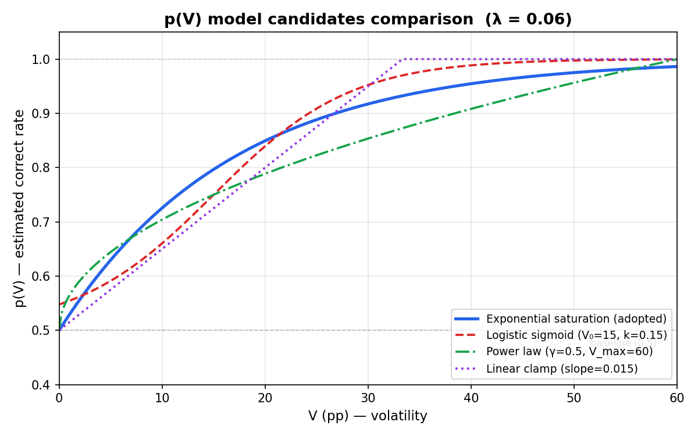

# Game Concept — Design Draft v1

이 문서는 `gamblers-gambit` 게임의 최초 설계 초안이다. 아직 코드는 없으며, 이후 커밋들이 여기 적힌 가정과 공식을 데이터·플레이테스트로 검증해 나갈 예정이다.

모든 결정은 **작업가설(working assumption)** 로 간주한다. 반증되면 바로 뒤집는다.

**파라미터 원칙**: 이 문서에 등장하는 모든 수치(λ, α, β, μ, cooldown, T_0, T_min, k_T, 페이즈 경계 등)는 **"적절히 괜찮은 초기값"** 일 뿐이다. 확정된 값이 아니며, 플레이테스트 및 리서치(R1~R5)를 통해 채워 나간다. 숫자가 적혀 있다고 고정된 것으로 읽지 말 것.

---

## Concept

- 플레이어는 시작 시 **100 유닛**의 뱅크롤을 받는다.
- 한 라운드는 체스 포지션과 그 위에서 벌어지는 **어떤 액션(수, move)** 을 제시하고, 플레이어가 그 액션이 포지션의 승률(winrate)에 미치는 영향에 **베팅** 하는 구조다.
  - 예: "이 수가 승률을 올릴까 내릴까?" (binary up/down), "변동폭이 X [pp](./glossary.md#percent-point-pp) 이상일까?" (threshold) 등. 정확한 betting mode 는 아직 미확정 (Open Questions 참조).
- 게임의 의도된 감각:
  - **변동폭(= 수 전후 승률 변화의 크기) 이 클수록 맞추기 쉽다**는 작업가설에 기반한다.
  - 쉬운 문제(큰 변동)는 **맞춰도 조금, 틀리면 크게** 잃는다.
  - 어려운 문제(작은 변동)는 **맞추면 크게, 틀려도 조금**만 잃는다.
  - 즉, 배당이 **난이도 축을 따라 비대칭**이다. [하우스 엣지](../background/gambling-primer.md#house-edge)는 이 비대칭의 크기(α, β, Payout 섹션)로 제어한다.

서브타이틀 "체스 고수가 되기 위한 도박판"과 맞닿게, 플레이어는 돈을 벌려면 결국 **quiet / subtle 한 수의 미묘한 우열을 읽는 눈**을 길러야 한다. 블런더만 잘 잡아서는 돈이 잘 안 불어나도록 곡선을 설계한다.

### Design goals

이 게임이 **달성하려는 것**:

- **Positional judgment 훈련**: "이 수가 미묘하게 좋은/나쁜 수인가" 를 읽는 감각을 강화. blunder detection 은 보너스, 메인이 아님. 목표는 **계산(calculation) 이 아니라 직관(intuition)** — 따라서 라운드당 판단 시간을 의도적으로 짧게 제한한다 (기타 설계 원칙 참조).
- **세션 긴장감 곡선**: 뱅크롤 100 유닛이 너무 빨리 터지지도, 너무 안 줄어들지도 않아야 함. 그리고 **단순한 평평한 곡선이 아니라 뒤로 갈수록 버티기 힘들어지는** 형태를 목표로 한다. 세부 메커니즘 ([램핑 엣지](./glossary.md#ramping-house-edge) / [betting mode 에스컬레이션](./glossary.md#betting-phase-베팅-페이즈) / [serendipity round](./glossary.md#serendipity-round)) 은 Session arc 참조.
- **정보 비대칭 유지**: 플레이어는 자신의 직관만으로 판단. 엔진 평가를 그대로 보여주면 게임이 죽는다.

이 게임이 **달성하지 않는 것** (혼동 방지용):

- **완전 공정 EV**: 순수 skill 게임이 아니라 gamble. 의도된 하우스 엣지 O.
- **체스 룰 튜터링**: 플레이어가 체스 기본 룰·기본 전술을 이미 안다고 가정. 규칙 설명은 범위 밖.
- **엔진 평가의 재현**: 우리 목표는 "엔진이 뭐라 할지" 를 맞히는 게 아니라, **위에서 언급한 비대칭 배당 곡선 위에서 플레이어가 장기적으로 positional 감각을 기르게** 만드는 것.

---

## Metric 선택: centipawn vs winrate (pp)

| 기준 | 장점 | 단점 |
|---|---|---|
| **Centipawn (cp)** | 체스 엔진이 직접 주는 원시값. 정밀도 높음. | 비선형. +300cp→+400cp와 0→+100cp의 체감이 완전히 다름. 이미 승부가 기운 포지션에서 무의미. |
| **Winrate (wp, %)** | 0~100으로 bounded, 직관적. 베팅 대상("승률을 올리나?")과 단위가 일치. | Ceiling effect (99% 근처의 작은 변동은 무시해야 함). 엔진 출력에서 변환 필요. |

**결정**: 표면에 드러나는 metric은 **winrate (단위 pp)** 을 쓴다. cp는 내부 계산용.

**cp → wp 변환식** (Lichess 계열, `wp`는 백 기준 승률 %):

```
wp = 50 + 50 * (2 / (1 + exp(-0.00368208 * cp)) - 1)
```

변환식의 선택 근거와 대안(Chess.com 계열 등) 비교는 **R2** (→ `research-tasks.md`) 에서 수행.

---

## 난이도 가정과 반례

### 작업가설

> 한 수 전후의 **[변동폭](./glossary.md#변동폭-v) V = |wp_after − wp_before|** (단위 pp) 가 클수록, 플레이어가 "승률이 올랐다/내렸다"를 맞출 확률 p 가 커진다.

이 가정이 성립해야 Payout 섹션의 비대칭 배당이 공정성 축에서 해석 가능하다.

### 반례와 경계 조건 (잊지 말 것)

- **희생수 (sacrifice)**: Qxh7+ 류. 실제로는 +20 pp 인데 초보자 눈엔 "말 버리는 수"로 보여 오히려 역베팅 유도. 즉 **"큰 V = 쉬움"이 깨지는 대표 케이스**.
- **Quiet move / prophylactic / zugzwang**: V 가 작지만 게임을 결정짓는 수. 놓치면 수 뒤에 큰 변동이 몰아 온다.
- **ELO 의존성**: 같은 V 라도 1200 와 2000 이 느끼는 난이도가 다르다. p(V) 는 사실 p(V, ELO).
- **Only move 여부**: 다른 수가 모두 나쁠수록 "이 수는 당연히 승률 유지" 로 읽히기 쉬움 — 변동폭과는 독립적인 난이도 신호.

→ 장기적으로 p(V) 를 `p(V, tactical_features)` 로 확장. 신호 후보는 **R4**.

---

## Payout 공식 초안

> **Betting mode 의존성**: 정답률 모델 `p(V)` 과 배당 공식은 betting mode 에 따라 **별도로 설계** 해야 한다. Mode 가 바뀌면 baseline 정답률, 난이도 축, skill tax 의 적절한 크기가 모두 달라진다. 아래 수식은 **up/down mode** 전제.

**기호 요약** (난이도 가정 섹션에서 도입된 것 재확인):

- `V` — [변동폭](./glossary.md#변동폭-v), `|wp_after − wp_before|`, 단위 pp.
- `p` — 플레이어 정답률 (V 의 함수로 모델링).
- `α, β` — skill tax 파라미터 (Payout 배당 파트에서 도입).
- `λ` — p(V) 곡선의 경사 (아래 정답률 모델에서 도입).

### 정답률 모델

```
p(V) = 0.5 + 0.5 * (1 − exp(−λ * V))
```

- V=0 → p=0.5 (찍기)
- V → ∞ → p → 1
- **λ** 는 캘리브레이션 파라미터. 초기 추측 λ ≈ 0.06 (V=15pp일 때 p≈0.7). 실측 후 보정 (**R3**).

**모델 선택 근거**: 특정 논문이 아니라, "0 에서 시작해 1 로 포화하는" 범용 패턴인 **exponential saturation** (`1 − exp(−λx)`) 을 `[baseline, 1]` 구간에 affine 매핑한 것. 파라미터가 λ 하나뿐이라 **가장 적은 가정** 으로 "V=0 → 찍기, V→∞ → 확실, 중간은 부드러운 연결" 세 조건을 만족. 대안 후보(logistic sigmoid, power law, linear clamp) 비교 및 데이터 기반 모델 교체는 **R3** 에서 다룸.



*파란 실선이 현재 채택한 exponential saturation. 네 후보 모두 같은 세 조건을 만족하지만 중간 구간(V=10~30)에서의 곡률이 다르다. 실측 데이터(R3)가 쌓이면 가장 fit 이 좋은 모델로 교체.*

**알려진 단순화**: 현재 p 는 V 만의 함수이지만, 실제로는 **wp_before** (수를 두기 전 승률) 에도 의존할 가능성이 높다. 예컨대 wp_before ≈ 95% 인 포지션에서는 "이 수가 승률을 올리나?" 에 대한 답이 거의 자명하고 (이미 이기고 있으니 대부분의 수가 유지/미세 변동), wp_before ≈ 50% 근처에서는 같은 V 라도 방향을 읽기 어렵다. 즉 `p = f(V, wp_before)` 가 더 정확한 모델이다. 현재는 **MVP 단순화를 위해 V 단일 변수로 출발**하고, R3 데이터가 쌓이면 wp_before 축 추가를 검토한다 (R4 의 tactical features 와 같은 확장 경로).

### 배당

공정 배당과, 그 위에 얹는 비대칭(skill tax)을 분해한다.

```
base_odds  = (1 − p) / p
s(V)       = min(1, V / 100)          # "쉬움 지수" (0~1, V>100 시 clamp)
win_payout = base_odds * (1 − α * s(V))
loss_mult  = 1         * (1 + β * s(V))
```

- `win_payout`: 맞췄을 때 베팅액 대비 **순이익 배수**.
- `loss_mult`: 틀렸을 때 베팅액 대비 **손실 배수**.
- α ∈ [0, 1]: 쉬운 문제의 리워드 축소율.
- β ∈ [0, 1]: 쉬운 문제의 손실 증폭율.
- α = β = 0 이면 공정 배당(EV=0). α, β 를 키울수록 하우스 엣지 + 의도된 비대칭.

### 예시 테이블 (λ=0.06, α=0.5, β=1.0, 베팅 10유닛)

| V (pp) | p(V)  | 맞춤 (+) | 틀림 (−) | EV    |
|:------:|:-----:|:--------:|:--------:|:-----:|
|   2    | 0.553 |   +7.4   |   −10.2  | −0.5  |
|  10    | 0.725 |   +3.4   |   −11.0  | −0.5  |
|  25    | 0.888 |   +1.0   |   −12.5  | −0.5  |
|  50    | 0.975 |   +0.1   |   −15.0  | −0.3  |
|  80    | 0.996 |   +0.002 |   −18.0  | −0.07 |

의도한 감각(쉬운 문제 = 짠 리워드 + 큰 손실)이 숫자로 확인됨. α, β 조정은 R1/R3 데이터 수집 후.

> **참고**: 여기서 α, β 는 상수로 표기되어 있지만, 실제 설계상 **라운드 번호 t 의 함수** (`α(t)`, `β(t)`) 로 확장된다. [세션 아크](./glossary.md#session-arc-세션-아크)에서 함께 다룸.

---

## Session arc — escalation & serendipity

per-round 수식(Payout 섹션) 위에 얹히는 **세션 레벨** 메커니즘. 핵심 감각은 "뒤로 갈수록 버티기 힘들지만, 버티면 숨구멍이 찾아온다" 이다 (Design goals 세션 긴장감 곡선).

세 메커니즘이 독립적으로 돌면서 서로 강화한다.

### Ramping house edge

α, β 를 라운드 번호 `t` 의 증가 함수로 확장.

```
α(t) = min(α_max, α_0 + k_α · t)
β(t) = min(β_max, β_0 + k_β · t)
```

- 초반 (`t` 작음): α, β ≈ 0 에 가까워 거의 공정 배당 → 플레이어가 흐름을 탈 수 있음.
- 후반: 상한 α_max, β_max 에 도달해 "쉬운 문제도 푼돈, 틀리면 치명타" 구조.
- 튜닝 손잡이: `α_0, β_0, k_α, k_β, α_max, β_max`. 플레이테스트로 찾음 (R3 확장).

효과: 같은 V, 같은 베팅액이라도 **라운드가 진행될수록 기대값이 점점 악화**. 플레이어는 "한 번 잃기 시작하면 복구가 점점 어렵다" 는 압박을 체감.

### Betting mode escalation

베팅 **형태 자체** 가 페이즈마다 바뀌면서 baseline 찍기 확률이 단계적으로 떨어진다.

| Phase | 라운드 (예시) | 형태 | Baseline 찍기 p |
|:-:|:-:|:-|:-:|
| 1 | 1–10 | binary up/down | 0.5 |
| 2 | 11–20 | multi-choice (4개 후보 중 best) | 0.25 |
| 3 | 21+ | exact value (V 값을 좁은 range 로 예측) | ≪ 0.25 |

- p(V) 의 상수항(현재 0.5) 이 페이즈에 따라 **0.5 → 1/N → baseline_range** 로 교체됨 (R5 를 각 페이즈마다 수행).
- 페이즈 경계는 라운드 수 기반(단순) 또는 뱅크롤 기반(동적). 단순쪽을 기본으로 채택 예정.
- 전환 시점에 플레이어에게 **명시적 UI 시그널** 필요 — "규칙 바뀐 줄 몰랐다" 는 좌절을 방지.

효과: 같은 뱅크롤이라도 후반 페이즈에선 **한 번의 오답이 더 비싸다** (baseline 이 낮아서 loss_mult 가 커짐). Design goals 의 포지셔널 훈련 목표와도 맞물림 — subtle judgment 없이는 후반 페이즈를 못 뚫는다.

### Serendipity round

매 라운드마다 **확률적으로** 발동할 수 있는 bonus 라운드. 플레이어의 뱅크롤이나 승패 상태와 **무관** 하게 "우연히" 찾아온다 — 서바이벌 게임에서의 뜻밖의 행운.

**트리거**:

매 라운드 시작 시, 발동 확률 `p_seren` 을 굴린다:

```
eligible = max(0, rounds_since_last_trigger − cooldown)
p_seren  = 1 − exp(−μ · eligible)
```

- `rounds_since_last_trigger`: 직전 serendipity 이후 경과 라운드. 세션 시작 시 0, 트리거 발동 시 0 으로 리셋, 이후 라운드마다 +1.
- `cooldown`: 발동 직후 잠기는 라운드 수 (예: 3~5). 연속 발동 방지.
- `μ`: 확률 상승 속도. 작을수록 뜸하고, 클수록 자주. 튜닝 대상.
- 효과: cooldown 해제 직후에는 확률 낮음 → 라운드가 쌓일수록 거의 확실히 한 번은 터짐 → **"언제 올지 모르지만 결국 온다"** 의 긴장.
- 세션 전반적으로 `t` 가 커지면 `eligible` 도 빠르게 쌓이므로 **후반일수록 serendipity 빈도가 자연스럽게 올라간다** (ramping edge 의 압박과 대비되는 숨구멍).

**형태**:
- "**그럼 뭘 했어야 했지?**" — 직전 일반 라운드에서 실제 best move 가 무엇이었는지 고르기 (multi-choice, 4~5개 후보 중 하나).
- Baseline 이 낮고, V 정보가 숨겨진 상태라 일반 라운드보다 어려움.

**보상 구조**:
- 맞췄을 때: 일반 라운드 대비 **큰 배수** (예: `win_payout_seren = k · base_odds`, `k ≥ 2`). 한 번에 흐름을 뒤집을 수 있는 수준.
- 틀렸을 때: 손실은 일반 라운드와 비슷하거나 **오히려 작게** (serendipity 는 페널티가 목적이 아님).
- 즉, serendipity 는 **EV > 0 에 가깝거나 플레이어 유리** 하게 기울여도 됨 — 게임 전체 EV 는 여전히 house edge 가 우위지만, serendipity 는 의도적 숨구멍.

### Time pressure ramp

라운드당 판단 시간도 세션 아크를 따라 줄어든다.

```
time_limit(t) = max(T_min, T_0 − k_T · t)
```

- `T_0`: 초기 시간 제한. **15~20초** 기본.
- `T_min`: 하한. **5초**. 이 아래로는 내려가지 않음.
- `k_T`: 라운드당 감소량 (단위: 초/라운드). 튜닝 대상.
- 효과: 초반에는 "볼 시간이 좀 있다" → 후반에는 "거의 즉답" 강제. Ramping edge 와 betting mode escalation 이 **경제적 압박** 이라면, time ramp 는 **인지적 압박** — 둘이 동시에 조여 오면서 세션 긴장감이 비선형으로 치솟음.
- 타이머 소진 시: 강제 패배(wrong answer) 처리 vs 강제 패스(기회 손실) — 둘 중 하나로 결정 필요 (Open Questions).

### 네 메커니즘의 상호작용

- Ramping edge + betting mode escalation + time pressure 셋만 있으면 **선형 절망** 곡선이다. Serendipity 가 **비선형 희망 스파이크** 를 주입해 "포기하지 말고 버텨" 의 긴장감을 만듦.
- Serendipity 트리거가 플레이어 상태와 무관하므로, 잘하고 있을 때 뜨면 **가속**, 못하고 있을 때 뜨면 **역전 찬스** — 동일 메커니즘이 두 가지 서사를 모두 생성.
- 네 메커니즘 모두 `t` (라운드) 에 의존. 튜닝의 자유도가 커서 실측 전에는 값 고정 금지 — R3 의 플레이테스트에서 **세션 길이·파산률·serendipity 빈도·타이머 소진 비율** 을 관측해 보정.
- **압박 축 요약**: 경제(α, β ↑) + 인지난이도(phase ↑) + 시간(timer ↓) + 확률적 숨구멍(serendipity).

---

## 기타 설계 원칙

- **시간 압박**: 라운드당 판단 시간을 **짧게 제한**. 충분한 시간이 주어지면 플레이어는 수를 머릿속으로 따라가며 계산하게 되고, 그러면 이 게임은 "직관 훈련" 이 아니라 "느린 체스 엔진 흉내" 가 된다. 짧은 시간은 직관에 기댈 수밖에 없는 환경을 강제하며, 동시에 세션 템포를 유지해 긴장감 곡선(Session arc)에도 기여. 시간 제한은 **세션 아크의 네 번째 압박 축** 으로 기능한다 (Time pressure ramp 참조).
- **정보 비대칭**: 엔진의 cp/wp 평가는 라운드 중 숨긴다. 공개하면 베팅이 trivial 해짐.
- **공정성 보정**: α(t), β(t) 가 아무리 커도 **"베팅 안 하는 것이 베팅하는 것보다 EV 높다"** 는 상황은 유지. 아니면 플레이어가 패스를 학습해버린다.
- **게임 세션 길이**: 뱅크롤 소진까지 평균 N 라운드 정도가 되도록 ramping 파라미터 · 페이즈 경계 · 베팅액 상한 · serendipity μ/cooldown 을 튜닝. N 의 목표값은 플레이테스트 후 결정.

---

## Worked example (한 라운드)

설계의 감각을 구체 숫자로 확인하기 위한 예시. 아직 betting mode 는 미확정이므로 가장 단순한 **binary up/down** 을 가정한다.

**시작 상태**

- 플레이어 뱅크롤: 100 유닛.
- 제시되는 포지션의 내부 평가: `wp_before = 60%` (플레이어에겐 숨김).
- 제시되는 수: `Qxh5`.
- 플레이어 입력: "승률이 **오른다**" 에 10 유닛 베팅.

**엔진 계산 & 배당 산출**

- `wp_after = 78%` → `V = |78 − 60| = 18 pp`
- `s(V) = 18 / 100 = 0.18`
- `p(V) = 0.5 + 0.5 · (1 − exp(−0.06 · 18)) ≈ 0.830`
- `base_odds = (1 − 0.830) / 0.830 ≈ 0.205`
- 파라미터: α = 0.5, β = 1.0
- `win_payout = 0.205 · (1 − 0.5 · 0.18) ≈ 0.186`
- `loss_mult  = 1     · (1 + 1.0 · 0.18) = 1.18`

**정산**

- 이 라운드의 참 정답은 "오른다" (V 가 양의 방향).
- 플레이어가 맞췄으므로 **+10 · 0.186 ≈ +1.86 유닛**. 뱅크롤 100 → **101.86**.
- 만약 틀렸다면 **−10 · 1.18 = −11.80 유닛**. 뱅크롤 100 → 88.20.

**이 예시가 보여주는 것**

- V=18 은 중간 난이도지만 이미 "맞춰도 1.86 / 틀리면 11.80" 의 강한 비대칭이 발생. 변동폭이 커질수록 이 간격이 더 벌어짐 (Payout 예시 테이블 참조).
- 플레이어는 이 배당을 **보여주지 않는 선택지도** 있다 (정보 공개 범위, Open Questions #5). 베팅 전에 배당이 보이면 전략이 "EV 양수인 케이스에서만 베팅" 으로 수렴할 수 있다.

---

## Open Questions

다음 커밋들에서 **하나씩** 해소할 미결정 항목. 각 항목은 별도 설계 문서 또는 실험 결과로 답한다.

우선순위 태그:

- **P1 — 선결**: 다른 결정·수식을 고정하기 위한 전제. 먼저 풀어야 함.
- **P2 — 밸런스**: 게임 체감/세션 길이에 직접 영향. P1 이후.
- **P3 — 확장**: MVP 이후로 미뤄도 게임이 돌아감.

1. **[P1 · 선결] Betting mode 페이즈 시퀀스**
   - 단일 형태가 아니라 Betting mode escalation 의 **페이즈별 시퀀스**. 각 페이즈에 어느 형태를 배치하고, 경계(라운드 #)를 어디에 둘지 결정해야 함.
   - 후보 형태: (a) binary up/down · (b) binary threshold · (c) multi-choice · (d) numeric range.
   - 페이즈 수(2 vs 3 vs 4 이상) 도 여기서 결정.
   - 페이즈 전환의 UI 시그널 스펙도 포함 (Betting mode escalation 참조).
   - **→ R5 의 전제** (페이즈마다 baseline 재측정 필요). Payout 의 p(V) 상수항이 페이즈 함수로 교체됨.

2. **[P1 · 선결] 포지션 소스**
   - 마스터 게임 PGN (tactical + quiet 혼합, 현실감 ↑).
   - 엔진 vs 엔진 게임 (풍부한 생성량).
   - Lichess puzzle db (tactical 편향, 난이도 라벨 내장).
   - **→ R1 (V 분포) 의 입력.** 소스가 정해져야 V 구간 / 난이도 분포가 실측 가능.

3. **[P2 · 밸런스] Escalation 커브 튜닝**
   - Ramping house edge 의 `α_0, β_0, k_α, k_β, α_max, β_max`.
   - Betting mode escalation 의 페이즈 경계 라운드 번호.
   - 초반 "거의 공정" 구간의 길이는 얼마나? 후반 "치명타" 구간은 어느 정도 혹독해야 하나?
   - **플레이테스트 없이는 고정 금지.** R3 의 연장선.

4. **[P2 · 밸런스] Serendipity 파라미터 튜닝**
   - `μ` (확률 상승 속도), `cooldown` (발동 후 잠김 라운드 수) 의 초기값.
   - 보상 배수 `k` 의 초기값.
   - 세션 전체에서 기대 발동 횟수 — 너무 잦으면 serendipity 감이 사라지고, 너무 드물면 숨구멍 역할 실패.
   - "serendipity 에서도 졌을 때의 감정 설계" — 추가 페널티 없음이 기본.

5. **[P2 · 밸런스] 정보 공개 범위**
   - 현재 엔진 평가 노출 / 비노출 / 일부만 노출 (예: 직전 평가만).
   - 수의 SAN / 좌표 하이라이트 표시 여부.
   - 배당(`win_payout`, `loss_mult`)을 베팅 전에 보여줄지 여부. Design goals "정보 비대칭" 원칙과 연결.

6. **[P2 · 밸런스] 베팅액 규칙**
   - 고정 스텝 (1 / 5 / 10 / 25) vs 자유 입력.
   - 라운드당 상한 (예: 잔고의 20%) 도입 여부 → 뱅크럽트 속도 제어.
   - Serendipity 라운드의 베팅액 규칙은 별도(강제액 / 잔고 비율 등) — #4 와 연동.

7. **[P3 · 확장] 플레이어 ELO 적응**
   - λ 를 플레이어별로 개인화할지, 고정할지.
   - 초기엔 ELO 입력 받고 온라인 업데이트? 모두 고정값으로 MVP?
   - MVP 는 고정 λ 로 출발, 데이터 충분해지면 개인화 검토.

**해소 순서 제안**: #1 → #2 (병렬) → #3 · #4 (병렬, 세션 아크 튜닝) → #5 · #6 → #7.

---

## 관련 문서

- `research-tasks.md` — 이 초안의 가정들을 검증하기 위한 리서치 과제 목록.
- `glossary.md` — 본 문서에 쓰인 프로젝트 고유 용어 정의.
- [`../background/gambling-primer.md`](../background/gambling-primer.md) — EV, 하우스 엣지, 공정 배당 등 일반 도박/확률 개념.
- [`../background/chess-primer.md`](../background/chess-primer.md) — Elo, centipawn, SAN/PGN/FEN, 수의 유형, 엔진 용어 등 일반 체스 개념.
